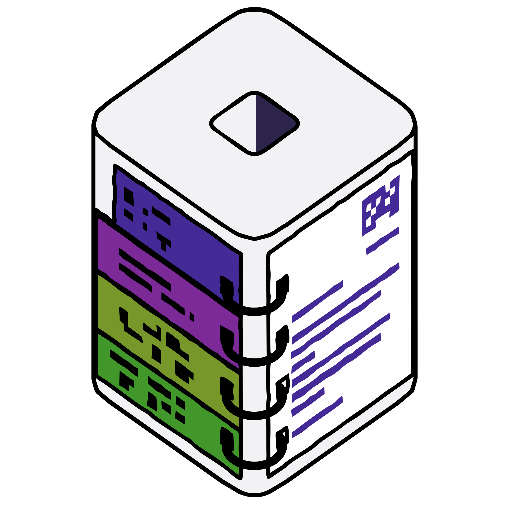
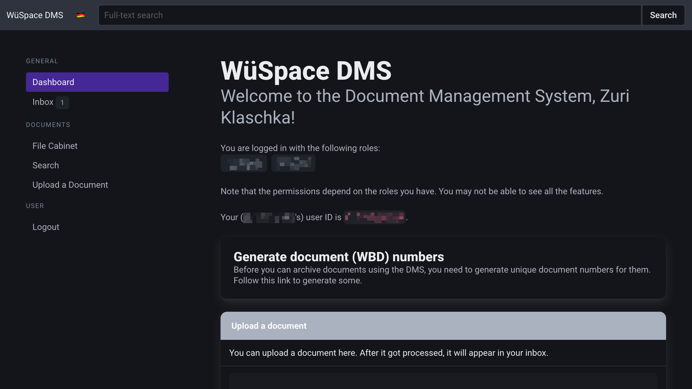
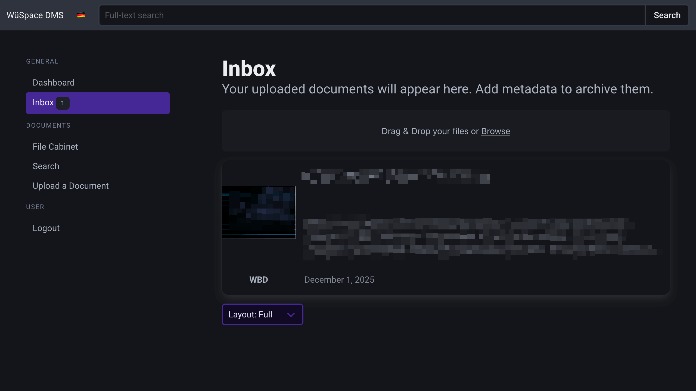
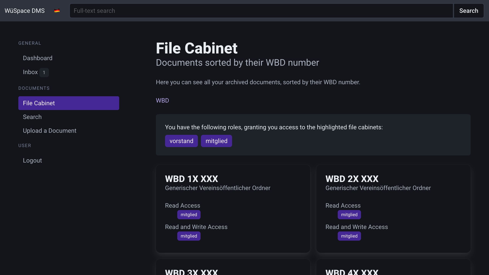
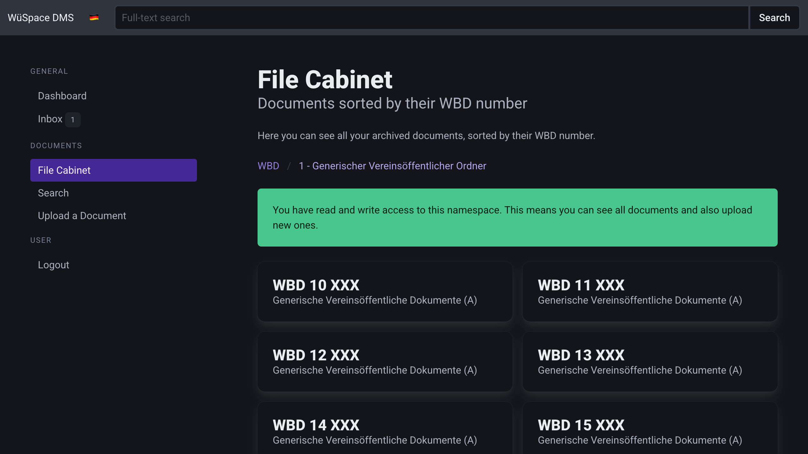
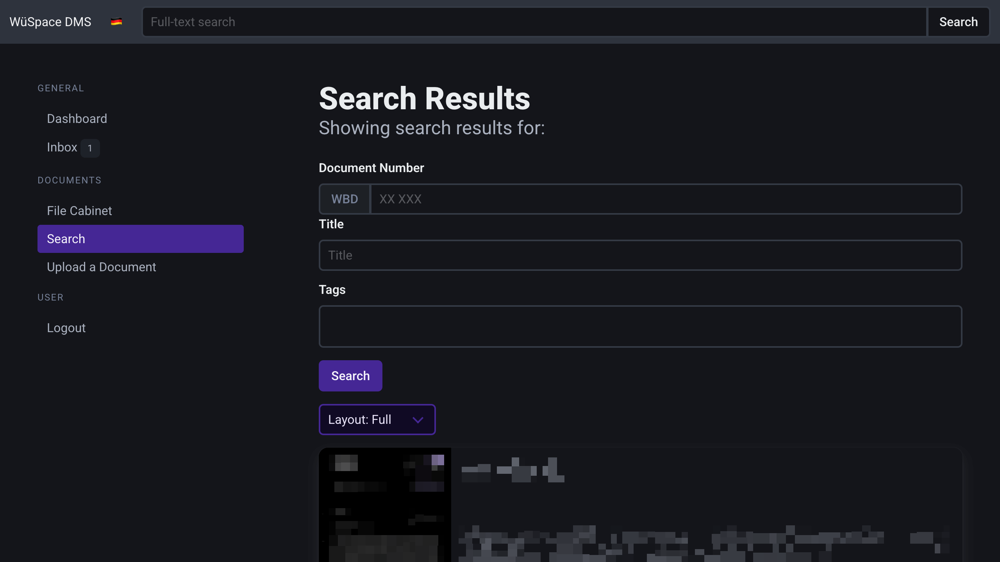
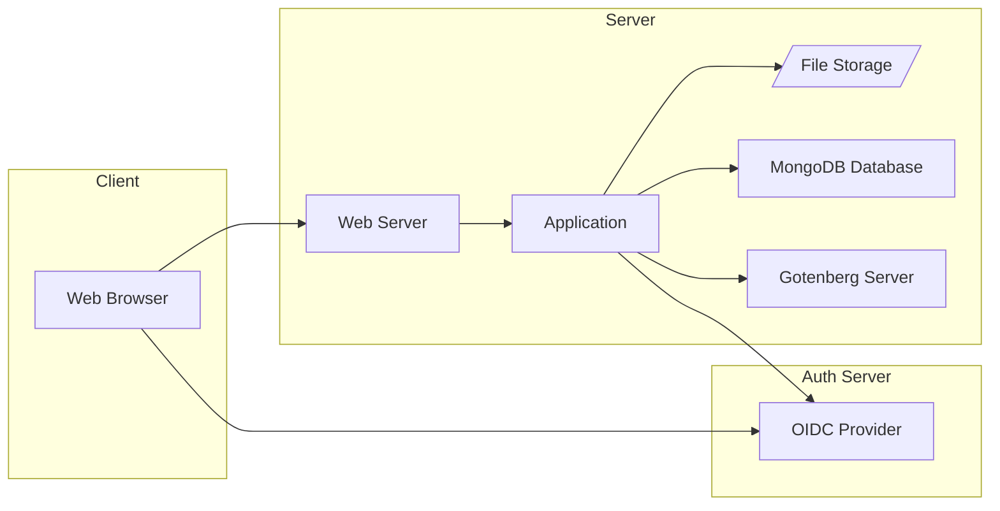

<div align="center">



# WüSpace DMS

**A modern, role-based Document Management System**

[](LICENSE)
[](Dockerfile)

🗂️ **Organized** • 🔐 **Granular Permissions** • 🌐 **Open Source**

</div>

---

## ✨ Features

- **Hierarchical Document Organization** – Organize documents using folders and
  registers with numeric prefixes
- **Role-Based Access Control** – Fine-grained read/write permissions per folder
- **Full-Text Search** – Quickly find documents by content, title, or document
  number
- **Document Processing** – Automatic PDF conversion and metadata extraction
- **OIDC Authentication** – Integrate with your existing identity provider
- **Inbox Workflow** – Upload documents and process them into the archive

## 📸 Screenshots

<table>
  <tr>
    <th>Dashboard</th>
    <td></td>
  </tr>
  <tr>
    <th>Inbox</th>
    <td></td>
  </tr>
  <tr>
    <th>File Cabinet Overview</th>
    <td></td>
  </tr>
  <tr>
    <th>File Cabinet Detail</th>
    <td></td>
  </tr>
  <tr>
    <th>Document Search</th>
    <td></td>
  </tr>
</table>

---

## 📖 User Guide

### Understanding Document Numbers

Each document in the system is identified by a unique **document number** (also
called ASN - Archive Serial Number). Document numbers follow a hierarchical
structure:

```
[PREFIX] [FOLDER][REGISTER] [SEQUENCE]
Example: WBD 51 001
         │   │ │   └── Sequence number (unique within the register)
         │   │ └────── Register number (category within folder)
         │   └──────── Folder number (main category)
         └──────────── Organization prefix
```

### Folders and Registers

The document numbering system uses a two-level hierarchy:

- **Folders** (first digit) – Major categories that group related document types
- **Registers** (second digit) – Subcategories within each folder for finer
  organization

> **Reserved folder digit**: The folder digit `9` is reserved for extensions
> that allow for additional hierarchy levels. For example, `9X`, `99X`, `999X`,
> etc. can be used to extend the numbering scheme when more granularity is
> needed.

For example:

| Document Number | Folder | Register | Description                 |
| --------------- | ------ | -------- | --------------------------- |
| WBD 51 001      | 5      | 1        | Decisions, bylaws, statutes |
| WBD 52 001      | 5      | 2        | Meeting protocols           |
| WBD 61 001      | 6      | 1        | Invoices                    |

> In the examples above, `001` represents the sequence number – each document
> gets the next available number in its register.

### Document Number Generation

Document numbers can be generated in two ways, indicated by suffixes in the
register names:

- **`(A)` – Auto-generated**: These numbers are typically generated through the
  linked ASN generator tool (accessible from the Dashboard). The system assigns
  the next available sequence number automatically.

- **`(M)` – Manual/Model-based**: These follow a custom numbering model where
  the sequence number has specific meaning (e.g., invoice numbers, membership
  IDs).

> **Note**: The `(A)` and `(M)` suffixes are conventions to help users
> understand how numbers are assigned – they are not enforced by the system.

### Folder/Register Administration

The folder and register structure is defined centrally in the system
configuration (`config/config.yml`). Changes to this structure typically require
administrative access and are managed by the organization's administrative body.

Each folder can have different:

- **Read permissions** – Roles that can view documents
- **Write permissions** – Roles that can create/modify documents

---

## 🔗 Integration with ASN Generator

This DMS is designed to work seamlessly with
[**deno-asn-generator**](https://github.com/wuespace/deno-asn-generator), a
companion tool for generating document numbers.

The ASN generator provides:

- A web interface for generating new document numbers
- Automatic sequence number management
- Integration with the same folder/register structure

Configure the generator URL in your `config.yml`:

```yaml
asnGeneratorUrl: https://your-asn-generator.example.com/
```

When configured, users will see a link on the Dashboard to generate new document
numbers before uploading documents.

---

## 🛠️ Development

Prerequisites:

- `docker`
- `docker-compose` v2.22+

### Configuration

Copy the `example.env` file to `.env` and adjust the values as needed.

```sh
cp example.env .env
```

You can also find an overview of the same configuration parameters in
[the configuration documentation](./env.md).

### Running the application

Run:

```sh
docker compose up --watch --build
# or
./dev.sh
```

## 🏗️ Architecture Overview



Whereas,

1. the `Web Browser` is the application the user interacts with.
2. the `Web Server` serves the application to the user.
3. the `Application` is the main application written in Hono / TypeScript /
   Deno.
4. the `MongoDB Database` is a document database based on MongoDB.
5. the `Gotenberg Server` can be used to convert documents to PDF.
6. the `OIDC Provider` is an auth server providing an OpenID Connect interface.
7. the `File Storage` is a storage for files.

The application works as follows:

1. The user interacts with the `Web Browser`.
2. The `Web Server` serves the application to the user.
3. The `Application` stores data in the `MongoDB Database` and files in the
   `File Storage`.
4. The `Application` can convert documents to PDF using the `Gotenberg Server`.
5. The `Application` uses the `Gotenberg Server` to extract metadata from
   documents.
6. The `Application` authenticates users using the `OIDC Provider`.

---

## 📄 License

This project is licensed under the MIT License - see the [LICENSE](LICENSE) file
for details.

---

<div align="center">

Made with ❤️ by [WüSpace e.V.](https://github.com/wuespace)

</div>
