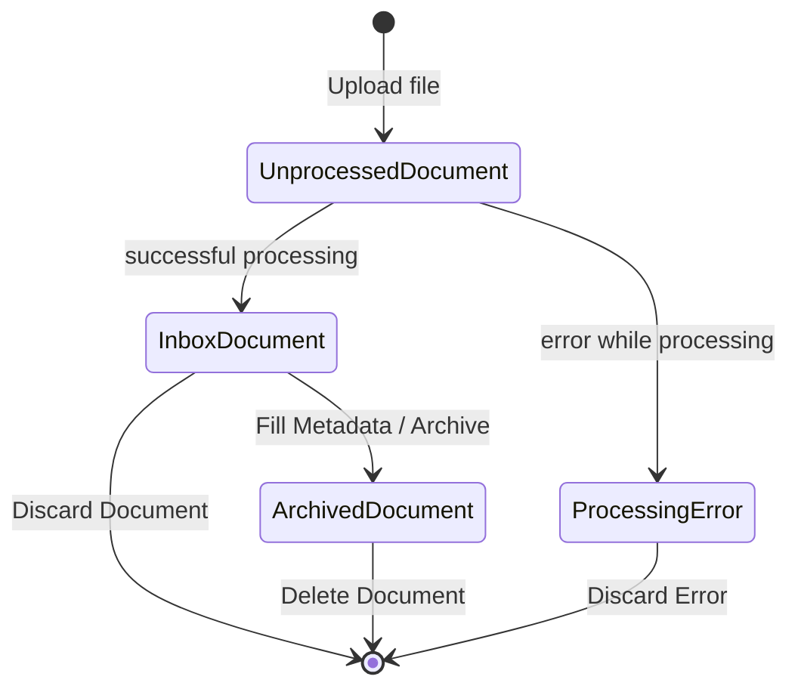

# Document Lifecycle

This module handles the transition of documents through the various stages of
their lifecycle.

## Lifecycle Stages

```mermaid
stateDiagram-v2

[*] --> UnprocessedDocument: Upload file

UnprocessedDocument --> InboxDocument: successful processing
InboxDocument --> [*]: Discard Document

UnprocessedDocument --> ProcessingError: error while processing
ProcessingError --> [*]: Discard Error

InboxDocument --> ArchivedDocument: Fill Metadata / Archive

ArchivedDocument --> [*]: Delete Document
```
