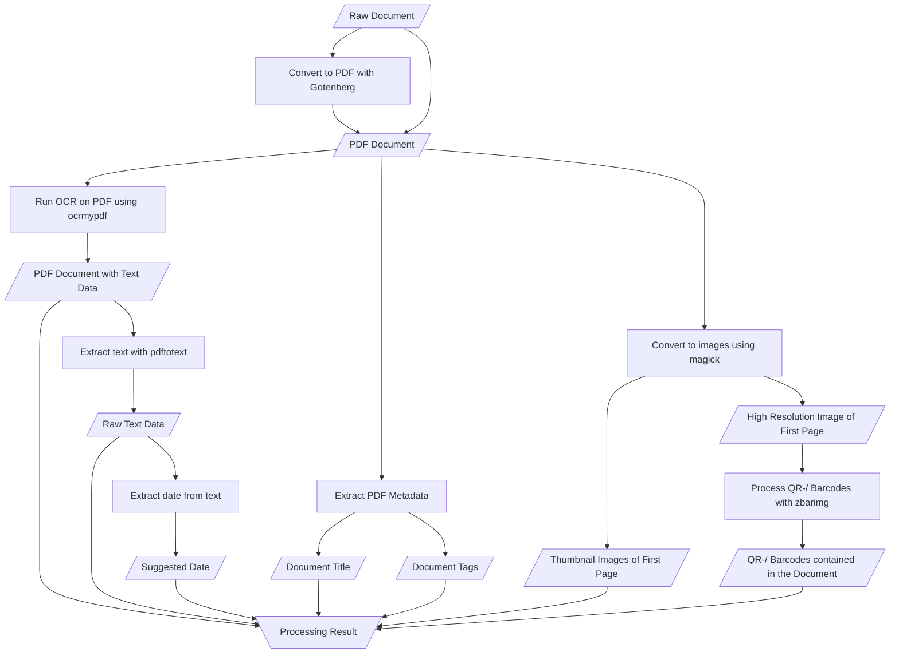

# Document Processing

This module is responsible for processing documents uploaded to the system. It
extracts text, metadata, and images from the document and runs OCR and barcode
processing on it.

## Out of Scope

This module does not interact with the database in any way. Its entrypoint is
the path to an unprocessed file and it returns the processed file paths and
extracted data.

## Pipeline

