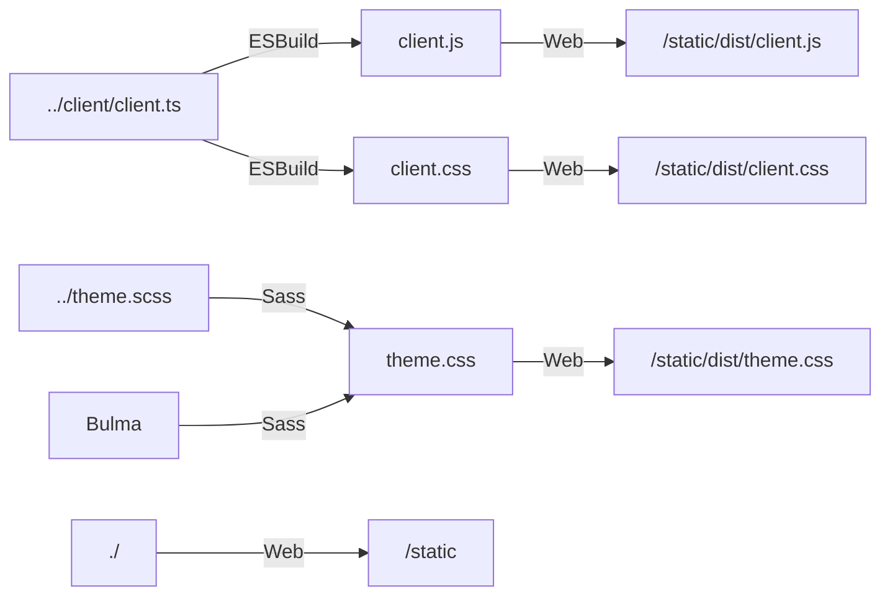

# Static Files

This directory contains static files that are used in the project. They are
available in the application at the `/static` URL.

## Generated static files

Next to some manual files, this directory also contains compiled / autogenerated
files. The compiled files get generated by the build process and you shouldn't
edit them manually. After the build process, the compiled files are available in
the `/static/dist` directory. In the normal development cycle they exist within
the Docker container.

Below is a diagram of the static files in the project with their respective
origins and build pipelines:

